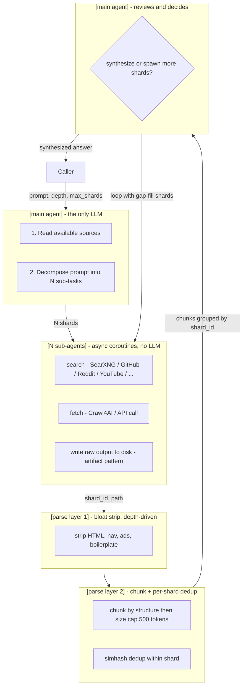

# Eyes-MCP

[]()
[]()
[]()
[]()

> **Research MCP for AI agents.** Docker-packaged. Swarm-ready. Zero required secrets.

A Model Context Protocol server that does the boring part of "go look this up on the internet" for any MCP-compatible agent. Callers send a question + a few parameters, Eyes-MCP fans out across SearXNG, Crawl4AI, GitHub, Reddit, YouTube, and more, and returns a synthesized answer with citations.

---

## What we're building



**Decisions locked in:**
- Only the main agent is an LLM. Sub-agents = async coroutines.
- Sub-agents write raw output to disk. Main agent sees pointers + chunks, not raw.
- Parse layer 1 = bloat strip. Aggressiveness driven by the `depth` param.
- No ranking. Every chunk goes to the main agent.
- Themes = shards. Main agent's decomposition defines the themes. No re-clustering.
- Crawl4AI's output is trusted for URL-fetched content — no re-stripping.

---

## Why this is different

There are at least five "SearXNG + Crawl4AI + MCP" wrappers already (see `02-existing-landscape.md`). What makes Eyes-MCP not the 6th me-too entry:

| Differentiator | What it means |
|---|---|
| **Zero-friction install** | `docker compose up` works with no API keys. LLM is optional. |
| **Shared service** | Streamable HTTP, stateful sessions, multi-tenant. Designed to be a service, not a personal daemon. |
| **Source-aware adapters** | GitHub, Reddit, YouTube, academic — each has a dedicated adapter, not a generic search-then-scrape path. |
| **Swarm-ready** | Main agent + sub-agents + two parse layers wired from day one (swarm flag-gated in v1). |
| **Artifact pattern** | Sub-agents write to disk, main agent reads chunks. Token cost is bounded by `EYES_TOKEN_BUDGET`. |

---

## Install

```bash
git clone https://github.com/your-org/eyes-mcp.git
cd eyes-mcp
cp .env.example .env       # edit GEMINI_API_KEY if you have one
docker compose up
```

The first run pulls three images: `searxng/searxng`, `unclecode/crawl4ai`, `redis`. Build pulls `node:20-alpine`. Total cold start: ~2 minutes.

**Important:** before exposing SearXNG to the network, replace `secret_key` in `searxng/settings.yml`:

```bash
openssl rand -hex 32
```

---

## Configure

All configuration is via environment variables. See [`.env.example`](./.env.example) for the full list with defaults. Highlights:

| Variable | Default | Purpose |
|---|---|---|
| `EYES_HTTP_PORT` | `8787` | HTTP listen port |
| `GEMINI_API_KEY` | _(empty)_ | Optional. If unset, server runs in heuristic-only mode. |
| `GEMINI_MODEL` | `gemma-4-31b-it` | Model served by the Gemini-compatible API |
| `SEARXNG_URL` | `http://searxng:8080` | Internal SearXNG endpoint |
| `CRAWL4AI_URL` | `http://crawl4ai:11235` | Internal Crawl4AI endpoint |
| `GITHUB_TOKEN` | _(empty)_ | Bumps GitHub REST rate limit 60/hr → 5000/hr |
| `REDDIT_CLIENT_ID` / `REDDIT_CLIENT_SECRET` | _(empty)_ | PRAW auth (optional) |
| `EYES_MAX_SHARDS` | `5` | Max shards per request (cap 20) |
| `EYES_MAX_ITERATIONS` | `2` | Max refinement iterations (cap 5) |
| `EYES_TOKEN_BUDGET` | `80000` | Token budget for the main agent's context |
| `EYES_TIME_BUDGET_SEC` | `120` | Wall-clock budget per request |

---

## Usage

The server speaks the MCP **streamable HTTP** transport on `/mcp` and a plain health probe on `/health`.

```bash
curl http://localhost:8787/health
# {"status":"ok","version":"0.1.0","uptime":12,"dependencies":{...}}
```

### MCP clients that work out of the box

- **Claude Desktop** — add to `claude_desktop_config.json`:
  ```json
  {
    "mcpServers": {
      "eyes": {
        "type": "http",
        "url": "http://localhost:8787/mcp"
      }
    }
  }
  ```
- **Cursor** — same config under MCP servers.
- **MCP Inspector** — point at `http://localhost:8787/mcp` to call tools interactively.
- Any other MCP client supporting streamable HTTP.

---

## Project layout

```
Eyes-MCP/
├── src/
│   ├── index.ts          ← HTTP server, /health, /mcp, signal handling (THIS SUBAGENT)
│   ├── health.ts         ← dependency probe (THIS SUBAGENT)
│   ├── util/logger.ts    ← winston logger (THIS SUBAGENT)
│   ├── tools/            ← MCP tool registration (subagent B)
│   ├── main-agent/       ← orchestrator + LLM client  (subagent B)
│   ├── llm/              ← Gemini/Gemma client         (subagent B)
│   ├── dispatcher/       ← shard fan-out + scheduling  (subagent B)
│   ├── adapters/         ← GitHub/Reddit/YouTube/etc.  (subagent C)
│   └── parse/            ← bloat strip + chunking      (subagent C)
├── searxng/              ← SearXNG config
├── data/                 ← runtime artifacts (gitignored)
├── docker-compose.yml
├── Dockerfile
├── package.json
├── tsconfig.json
├── .env.example
├── LICENSE               ← MIT
└── README.md             ← you are here
```

---

## Status

**Build in progress.** This repo is the result of a parallel subagent build:
- Subagent A (this) — skeleton, Docker, entrypoint, health, logger. ✅
- Subagent B — main agent, LLM client, dispatcher, tool registration. ⏳
- Subagent C — source adapters, parse layers. ⏳

After wire-up, see `03-architecture-main-and-swarm.md` for the full design.

---

## License

MIT. See [LICENSE](./LICENSE).
